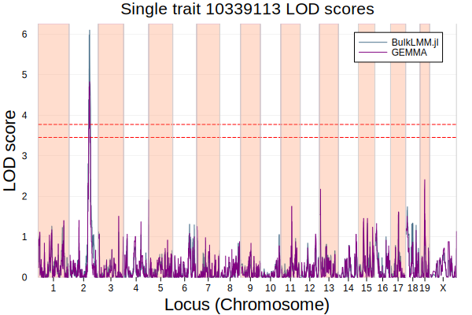
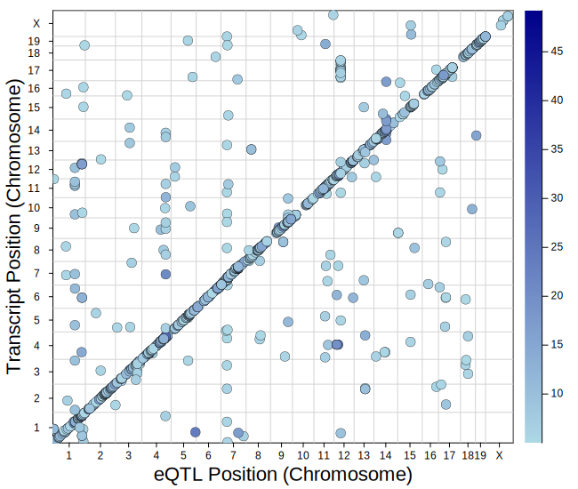

# BulkLMM.jl

BulkLMM is a Julia package for performing genome scans for multiple traits (in
"Bulk" sizes) using linear mixed models (LMMs). It is suitable for eQTL mapping
with thousands of traits and markers. BulkLMM also performs permutation
testing for LMMs taking into account the relatedness of individuals.
We use multi-threading and matrix operations to speed up computations.

The current implementation is for genome scans with one-degree of
freedom tests with choices of adding additional covariates. Future releases will
cover the scenario of more-than-one degrees of freedom tests.

## Background

### Linear Mixed Model (LMM)

We consider the case when a univariate trait of interest is measured
in a population of related individuals with kinship matrix $K$.  Let
the trait vector, $y$ follow the following linear model.

$$ y = X\beta + \epsilon,$$

where 

$$V(\epsilon) = \sigma^2_g K+\sigma^2_e I.$$

where $X$ is a matrix of covariates which would include the intercept,
candidate genetic markers of interest, and (optionally) any background covariates.
The variance components $\sigma^2_g$ and $\sigma^2_e$ denote the
genetic and random error variance components respectively.

### Single trait scan

For a single trait and candidate marker, we use a likelihood ratio
test to compare a model with and without the candidate genetic marker
(and including the intercept and all background covariates).  This
process is repeated for each marker to generate the genome scan.  The
result is reported in LOD (log 10 of likelihood ratio) units.

Users can specify if the variance components should be estimated using
ML (maximum likelihood) or REML (restricted maximum likelihood).  The
scans can be performed with the variance components estimated once
under the null, or separately for each marker.  The latter approach is
slower, but more accurate.

### Permutation tests for single trait

Under the null hypothesis that no individual genetic marker is
associated with the trait, traits are correlated according if the
kinship matrix is not identity, and the genetic variance component is
non-zero.  Thus, a standard permutation test where we shuffle the
trait data randomly, is not appropriate.  Instead, we rotate the data
using the eigen decomposition of the kinship matrix, which
de-correlates the data, and then shuffle the data after rescaling them
by their standard deviations.

### Scans for multiple traits

Scans for multiple traits are performed by running univariate LMMs for
each combination of trait and marker.  We are exploring algorithms for
optimizing this process by judicious use of approximations.

### Multi-threading

This package uses multi-threading to speed up some operations.  You
will have to start Julia with mutliple threads to take advantage of
this.  You should use as many threads as your computer is capable of.
Further speedups may be obtained by spreading (distributing) the
computation across mutliple computers.

## Installation:

The package `BulkLMM.jl` can be installed by running

```julia
using Pkg
Pkg.add("BulkLMM")
```

To install from the **Julia** REPL, first press `]` to enter the Pkg
mode and then use:

```
add BulkLMM
```

The most recent release of the package can be obtained by running 

```julia
using Pkg
Pkg.add(url = "https://github.com/senresearch/BulkLMM.jl", rev="main")
```

## Example: application on BXD spleen expression data

We demonstrate basic usage of `BulkLMM.jl` through an example applying
the package on the BXD mouse strains data.

First, after successfully installed the package, load it to the
current *Julia* session by

```julia
using BulkLMM
using CSV, DelimitedFiles, DataFrames, Statistics
```

The BXD data are accessible through our published [github
repo](https://github.com/senresearch/BulkLMM.jl) of the `BulkLMM.jl`
package as .csv files under the `data/bxdData` directory.

The original data for BXD spleen traits `BXDtraits_with_missing.csv`contains missing
values. We saved the data after removed any missings to the file named "spleen-pheno_nomissing.csv" under the same directory. 

```julia
bulklmmdir = dirname(pathof(BulkLMM));
pheno_file = joinpath(bulklmmdir,"..","data/bxdData/spleen-pheno-nomissing.csv");
pheno = readdlm(pheno_file, ',', header = false);
pheno_processed = pheno[2:end, 2:(end-1)].*1.0; # exclude the header, the first (transcript ID)and the last columns (sex)
```

Required data format for traits should be .csv or .txt files with
values separated by `','`, with each column being the observations of
$n$ BXD strains on a particular trait and each row being the
observations on all $m$ traits of a particular mouse strain.

Also load the BXD genotypes data. The raw BXD genotypes file
`BXDgeno_prob.csv` contains even columns that each contains the
complement genotype probabilities of the column immediately preceded
(odd columns). Calling the function `readBXDgeno` will read the BXD
genotype file excluding the even columns.

```julia
geno_file = joinpath(bulklmmdir,"..","data/bxdData/spleen-bxd-genoprob.csv");
geno = readdlm(geno_file, ',', header = false);
geno_processed = geno[2:end, 1:2:end] .* 1.0;
```

Required data format for genotypes should be .csv or .txt files with
values separated by `','`, with each column being the observations of
genotype probabilities of $n$ BXD strains on a particular marker place
and each row being the observations on all $p$ marker places of a
particular mouse strain.

For the BXD data, 


```julia
size(pheno_processed) # (number of strains, number of traits)
```


    (79, 35554)


```julia
size(geno_processed) # (number of strains, number of markers)
```


    (79, 7321)


Compute the kinship matrix $K$ from the genotype probabilities using the function `calcKinship` 

```julia
kinship = calcKinship(geno_processed); # calculate K
```

```julia
kinship = round.(kinship; digits = 12);
```

### Single trait scanning:

For example, to conduct genome-wide associations mapping on the
1112-th trait, we can run the function `scan()` with inputs of the trait (as
a 2D-array of one column), geno matrix, and the kinship matrix.


```julia
traitID = 1112;
pheno_y = reshape(pheno_processed[:, traitID], :, 1);
```


```julia
@time single_results = scan(pheno_y, geno_processed, kinship);
```

      0.059480 seconds (80.86 k allocations: 47.266 MiB)


The output `single_results` is an object containing model results about the variance components (residual variance and the heritability parameter) estimated under the null baseline model, and the lod scores, as the fields named respectively as "sigma2_e", "h2_null", and "lod".


```julia
# VCs: residual variance, heritability which is the proportion of genetic variance to total variance
(single_results.sigma2_e, single_results.h2_null)
```


    (0.09448827755838007, 0.8500907321964053)


```julia
# LOD scores calculated for a single trait under VCs estimated under the null (intercept model)
single_results.lod; 
```

`BulkLMM.jl` supports permutation testing for a single trait GWAS. Simply run the function `scan()` and set the optional keyword argument `permutation_test = true` with the required number of permutations as `nperms = # of permutations`. For example, to ask the package to do a permutation testing of 1000 permutations, do 


```julia
@time single_results_perms = scan(pheno_y, geno_processed, kinship; permutation_test = true, nperms = 1000);
```

      0.079464 seconds (94.02 k allocations: 207.022 MiB)

Similarly to the results of the single-trait scan with no permutation, `single_results_perms` contains the fields `sigma2_e`, `h2_null`, and `lod` for the original trait. Additionally, we report the results of permutation tests as the raw LOD scores computed for each permuted copies, which are stored in a matrix named as `L_perms` of dimension $p \times nperms$, where each column contains the LOD scores corresponding to $p$ markers on one permuted copy, and each row are the LOD scores for a particular marker fitted on all 1000 permuted copies.


```julia
size(single_results_perms.L_perms)
```

    (7321, 1000)

Based on the results of the permutation test, we can use the function `get_thresholds()` to obtain the LOD thresholds according to the quantile probabilities, based on the desired significance levels.

```julia
lod_thresholds = BulkLMM.get_thresholds(single_results_perms.L_perms, [0.90, 0.95]);
round.(lod_thresholds.thrs, digits = 4)
```

    3.3644  
    3.6504

Let's plot the BulkLMM LOD scores of the 1112-th trait and compare with the results from running
[GEMMA](https://github.com/genetics-statistics/GEMMA):

Note: to get results from GEMMA, one would need to run GEMMA on a Linux machine with input files of the same trait (here the 1112-th trait, X10339113), genetic markers and the kinship matrix, and finally convert the LRT p-values into corresponding LOD scores. Alternatively, you may simply load the results we obtained by following the procedures mentioned above. The resulting LOD scores from GEMMA are a .txt file in `data/bxdData/GEMMA_BXDTrait1112/gemma_lod_1112.txt`.



For reproducing this figure, we need to do the following steps:

First, read in the `gmap.csv` and the `phenocovar.csv` under `data/bxdData/` directory as

```julia
gmap_file = joinpath(bulklmmdir,"..","data/bxdData/gmap.csv");
gInfo = CSV.read(gmap_file, DataFrame);
phenocovar_file = joinpath(bulklmmdir,"..","data/bxdData/phenocovar.csv");
pInfo = CSV.read(phenocovar_file, DataFrame);
```
Next, load the results preprocessed from GEMMA:

```julia
gemma_results_path = joinpath(bulklmmdir,"..","data/bxdData/GEMMA_BXDTrait1112/gemma_lod_1112.txt")
Lod_gemma = readdlm(gemma_results_path, '\t'); # load gemma LOD scores results available in the package
```
Finally, we use the QTL plotting function from the package  [`BigRiverQTLPlots.jl`](https://github.com/senresearch/BigRiverQTLPlots.jl):

```julia
using BigRiverQTLPlots
traitName = pInfo[traitID, 1] # get the trait name of the 1112-th trait

plot_QTL(
	single_results_perms, 
	gInfo, 
	thresholds = [0.90, 0.95],
	legend = true,
	label = "BulkLMM.jl",
	title = "Single trait $traitName LOD scores"
)
plot_QTL!(
	vec(Lod_gemma), 
	gInfo, 
	linecolor = :purple, 
	label = "GEMMA", 
	legend = :topright
)
```

### Multiple traits scanning:

To get LODs for multiple traits, for better runtime performance, first
start *julia* with multiple threads following [Instructions for
starting Julia REPL with
multi-threads](https://docs.julialang.org/en/v1/manual/multi-threading/)
or switch to a multi-threaded *julia* kernel if using Jupyter
notebooks.

Then, run the function `bulkscan_null()` with the matrices of
traits, genome markers, kinship. The fourth required input is the
number of parallelized tasks and we recommend it to be the number of
*julia* threads.

Here, we started a 16-threaded *julia* and executed the program on a
Linux server with the Intel(R) Xeon(R) Silver 4214 CPU @ 2.20GHz to
get the LOD scores for all **~35k** BXD traits:


```julia
@time multiple_results_allTraits = bulkscan_null(pheno_processed, geno_processed, kinship; nb = Threads.nthreads());
```

     82.421037 seconds (2.86 G allocations: 710.821 GiB, 41.76% gc time)


The output `multiple_results_allTraits` is an object containing our model results:
- the matrix of LOD scores $L_{p \times m}$, where $p$ is the number of markers and $m$ is number of traits; each column corresponds to the LOD scores resulting from performing GWAS on each given trait.
- the vector of heritability estimate per trait, `h2_null_list`, obtained from fitting the null model. 

```julia
size(multiple_results_allTraits.L)
```

    (7321, 35554)

```julia
length(multiple_results_allTraits.h2_null_list)
```

    35554

To visualize the multiple-trait scan results, we can use the plotting function `plot_eQTL` from `BigRiverQTLPlots.jl` to generate the eQTL plot.
In the following example, we only plot the LOD scores that are above 5.0 by calling the function and specifying in the optional argument `threshold = 5.0`:

```julia
plot_eQTL(multiple_results_allTraits.L, pheno, gInfo, pInfo; threshold = 5.0)
```




## Contact, contribution and feedback

If you find any bugs, please post an issue on GitHub or contact the
maintainer ([Zifan Yu](https://github.com/learningMalanya)) directly.
You may also fork the repository and send us a pull request with any
contributions you wish to make.


Check out NEWS.md to see what's new in each `BulkLMM.jl` release.
